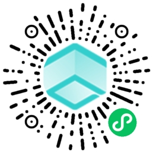

# summary

本项目演示使用 [https://uniapp.dcloud.io/](https://uniapp.dcloud.io/) 二次开发云雀 APP。

## 列表页

列表页主要演示获取应用列表，区域信息，和调用进入应用接口。主要关注以下三个后台接口

1. 应用列表

```api
getAppliList
```

1. 区域信息

```api
renderServer/regionList
```

1. 进入应用

```api
appli/getStartInfo
```

## 云渲染客户端页面

主要关注 `web-view` 嵌入 云雀web客户端

## 打包发布

uniapp 可以打包成原生 APP，网页小程序等。

微信小程序预览

